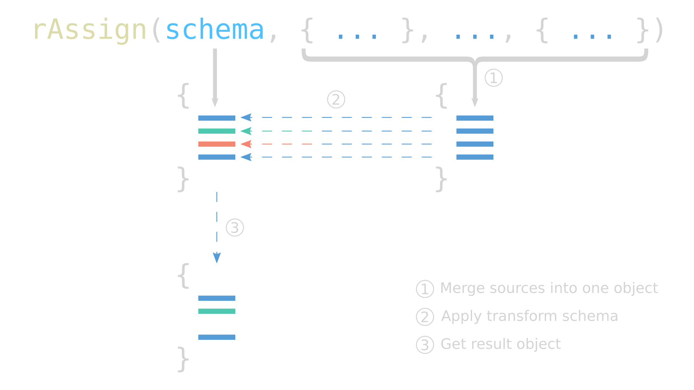

# r-assign

[](https://www.npmjs.com/package/r-assign)
[](https://coveralls.io/github/micnic/r-assign)
[](https://www.npmjs.com/package/r-assign)
[](https://www.npmjs.com/package/r-assign)
[](https://www.npmjs.com/package/r-assign)

`Object.assign()` with a transforming feature for filtering, mapping, and
validating object properties.

`r-assign` has its own schema declaration based on the concept of TypeScript
type predicates, it is composed of pure functions that can be used separately
from `r-assign`.

When to use `r-assign`?
- When needing to apply filtering or mapping of object properties
- When dealing with data from untrustworthy sources, to validate and parse them
- When providing a configurable interface with strict constraints
- When doing complex transformations in objects with interdependent properties
- When reinforcing TypeScript declarations in runtime

Reasons to use `r-assign`:
- Functional approach
- Modular, import only what you need without bloating your project
- TypeScript support
- Expressive in defining complex schemas
- Flexible to create custom transforming functional
- Helpful at preventing undesired values (like `NaN` when working with numbers
  or `Invalid Date` when working with dates)

## Table of contents
- [Install](#install)
- [Usage](#usage)
- [Import utility functions](#import-utility-functions)
- [Type guards](#type-guards)
- [Basic data types](#basic-data-types)
  - [Any](#any)
  - [Boolean](#boolean)
  - [Number](#number)
  - [String](#string)
  - [BigInt](#bigint)
  - [Symbol](#symbol)
  - [Undefined](#undefined)
  - [Null](#null)
  - [Literal](#literal)
  - [Template literal](#template-literal)
  - [Instance](#instance)
  - [Date](#date)
  - [Never](#never)
- [Complex data types](#complex-data-types)
  - [Array](#array)
  - [Object](#object)
  - [Tuple](#tuple)
  - [Record](#record)
  - [Function](#function)
- [Type operations](#type-operations)
  - [Union](#union)
  - [Intersection](#intersection)
  - [Optional](#optional)
  - [Partial](#partial)
  - [Required](#required)
- [Assert type](#assert-type)
- [Parse type](#parse-type)
- [Get type](#get-type)
- [Set same](#set-same)
- [Converting data](#converting-data)
- [Working with TypeScript](#working-with-typescript)
- [Mapping properties](#mapping-properties)
- [Filtering properties](#filtering-properties)
- [Complex interactions](#complex-interactions)

## Install

`npm i r-assign`

To take advantage of all TypeScript features in `r-assign` use latest TypeScript
versions (4.4+) and configure the compiler options with `strict` and
`exactOptionalPropertyTypes` enabled. `exactOptionalPropertyTypes` option is
required for the usage of `isOptional()` type guard, if the option is not
enabled the `isOptionalUndefined()` type guard should be used instead.

### ESM import

```js
import rAssign from 'r-assign';
```

### CJS require

```js
const rAssign = require('r-assign');
```

## Usage

```ts
type TransformSchema<T = any> = {
    [key: string]: (value: any, key: string, source: any) => T;
};

rAssign(schema: TransformSchema, ...sources: any[]): any;

// Note: The actual TypeScript definition is a bit more complex. Here is
//       displayed a simplified definition for an easier understanding of the
//       function signature and schema structure.
```

`r-assign` exports a function that accepts a `schema` object as the first
argument that defines the structure of the result by merging and transforming of
any `source` objects provided as the following arguments.

The `schema` argument is a user-defined object with properties as functions that
return a value based on the provided input from 3 arguments:

`(value: any, key: string, source: any) => any`
- the `value` from the source
- the `key` of the value
- the `source` itself

The returned value from the function will be part of the resulting object,
`undefined` values are skipped. The `r-assign` function will throw when any of
the provided functions from the `schema` throws.



### A very first example
```js
import rAssign from 'r-assign';

const someUnknownObject = { /* ... any structure here ... */ };

const objectABC = rAssign({
    abc: (value) => {

        // Check the type of the provided value
        if (typeof value === 'string') {

            return value; // Return the value itself   --------------------+
        }                                                               // |
                                                                        // |
        return 'abc'; // Return a default value        --------------------+
    }                                                                   // |
}, someUnknownObject);                                                  // |
                                                                        // |
/*                                                                         |
objectABC: {      Add the output of the function to the resulting object   |
    abc: 'abc' <-----------------------------------------------------------+
};
*/
```

Here is a very simple example of the basics of what `r-assign` can do. The
functions output provided in the schema is added to the resulting object. As the
schema is composed only of functions it can define very complex and flexible
functional. There are utility functions to simplify this example to the
following:

```js
import rAssign from 'r-assign';
import { getType } from 'r-assign/lib/get-type';
import { isString } from 'r-assign/lib/string';

const someUnknownObject = { /* ... any structure here ... */ };

const objectABC = rAssign({
    // Will return a string or the default value of "abc"
    abc: getType(isString, 'abc')
}, someUnknownObject);
```

## Import utility functions
```js
// Import all the needed functions from "r-assign/lib" submodule
import { getType, isNumber, isString } from 'r-assign/lib';

// Or import functions from specific submodule
import { getType } from 'r-assign/lib/get-type';
import { isNumber } from 'r-assign/lib/number';
import { isString } from 'r-assign/lib/string';
```

All utility functions are available for importing from `r-assign/lib`. To
prevent importing all the library it is recommended to import just the specific
submodules that will be used. The list of the available submodules is the
following:

[Basic Data Types](#basic-data-types)
- [`r-assign/lib/any`](#any)
- [`r-assign/lib/boolean`](#boolean)
- [`r-assign/lib/number`](#number)
- [`r-assign/lib/string`](#string)
- [`r-assign/lib/bigint`](#bigint)
- [`r-assign/lib/symbol`](#symbol)
- [`r-assign/lib/undefined`](#undefined)
- [`r-assign/lib/null`](#null)
- [`r-assign/lib/literal`](#literal)
- [`r-assign/lib/instance`](#instance)
- [`r-assign/lib/date`](#date)
- [`r-assign/lib/never`](#never)

[Complex Data Types](#complex-data-types)
- [`r-assign/lib/array`](#array)
- [`r-assign/lib/object`](#object)
- [`r-assign/lib/tuple`](#tuple)
- [`r-assign/lib/record`](#record)
- [`r-assign/lib/template-literal`](#template-literal)
- [`r-assign/lib/function`](#function)

[Type Operations](#type-operations)
- [`r-assign/lib/union`](#union)
- [`r-assign/lib/intersection`](#intersection)
- [`r-assign/lib/optional`](#optional)

[Transform Functions](#transform-functions)
- [`r-assign/lib/get-type`](#getting-data)
- [`r-assign/lib/parse-type`](#parsing-data)

## Type guards
`r-assign` is built around the concept of type guards which are just functions
that perform a runtime check and guarantees the type of a specific value.

```js
import { isString } from 'r-assign/lib/string';

isString('abc'); // => true

isString(42); // => false
```

Some type guards require configuration to be able to do more complex type
checking.

```js
import { isArrayOf } from 'r-assign/lib/array';
import { isString } from 'r-assign/lib/string';

const isArrayOfStrings = isArrayOf(isString);

isArrayOfStrings(['abc']); // => true

isArrayOfStrings([42]); // => false
```

All the type guards have shorter aliases.

```js
import { array } from 'r-assign/lib/array';
import { string } from 'r-assign/lib/string';

const stringArray = array(string);

stringArray(['abc']); // => true

stringArray([42]); // => false
```

---
## Basic Data Types

### Any

```js
import { isAny, any } from 'r-assign/lib/any';

isAny('abc'); // => true
isAny(); // => true, will always return true

// Alias:
any();
```

### Boolean

```js
import { isBoolean, boolean } from 'r-assign/lib/boolean';

isBoolean(false); // => true
isBoolean(true); // => true
isBoolean('false'); // => false, will return true only for boolean values

// Alias:
boolean(true);
```

### Number

```js
import { isNumber, number } from 'r-assign/lib/number';

isNumber(42); // => true
isNumber(NaN); // => false, will return true only for finite number values

// Alias:
number(42);
```

### String

```js
import { isString, string } from 'r-assign/lib/string';

isString('abc'); // => true
isString(''); // => true
isString(); // => false, will return true only for string values

// Alias:
string('abc');
```

### BigInt

```js
import { isBigInt, bigint } from 'r-assign/lib/bigint';

isBigInt(42n); // => true
isBigInt(42); // => false, simple number is not a bigint

// Alias:
bigint(42n);
```

### Symbol

```js
import { isSymbol, symbol } from 'r-assign/lib/symbol';

isSymbol(Symbol('abc')); // => true
isSymbol(Symbol()); // => true
isSymbol(); // => false, will return true only for symbol values

// Alias:
symbol(Symbol());
```

### Undefined

```js
import { isUndefined, undef } from 'r-assign/lib/undefined';

isUndefined(undefined); // => true
isUndefined(); // => true
isUndefined(null); // => false, will return true only for undefined values

// Alias:
undef(undefined);
```

### Null

```js
import {
    isNull,
    isNullable,
    isNullish,
    nulled,
    nullable,
    nullish
} from 'r-assign/lib/null';
import { isString, string } from 'r-assign/lib/string';

isNull(null); // => true
isNull(); // => false, will return true only for null values

// Alias:
nulled(null);

// Check for nullable values (T | null)
// Accepts a type guard as argument
const isNullableString = isNullable(isString); // string | null

isNullableString('abc'); // => true
isNullableString(null); // => true
isNullableString(); // => false

// Alias:
nullable(string);

// Check for nullish values (T | null | undefined)
// Accepts a type guard as argument
const isNullishString = isNullish(isString); // string | null | undefined

isNullishString('abc'); // => true
isNullishString(null); // => true
isNullishString(undefined); // => true
isNullishString(); // => true

// Alias:
nullish(string);
```

### Literal

```js
import {
    isLiteral,
    isLiteralOf,
    literal,
    literals
} from 'r-assign/lib/literal';

// Check for provided literal value
// Accepts a primitive value as argument
const isLiteralABC = isLiteral('abc'); // 'abc'

isLiteralABC('abc'); // => true
isLiteralABC('def'); // => false

// Alias:
literal('abc');

// Check for one of the provided literal values
// Accepts an array of primitive values as argument
const isLiteralOfABC = isLiteralOf(['a', 'b', 'c']); // 'a' | 'b' | 'c'

isLiteralOfABC('a'); // => true
isLiteralOfABC('b'); // => true
isLiteralOfABC('c'); // => true
isLiteralOfABC('d'); // => false

// Alias:
literals(['a', 'b', 'c']);
```

### Instance

```js
import { isInstanceOf, instance } from 'r-assign/lib/instance';

// Check for instance of provided class
// Accepts a constructor function as argument
const isDateInstance = isInstanceOf(Date); // Date

isDateInstance(new Date()); // => true

// Alias:
instance(Date);
```

### Date

```js
import { isDate, date } from 'r-assign/lib/date';

isDate(new Date()); // => true
isDate(new Date(NaN)); // => false, will return true only for valid date values

// Alias:
date(new Date());
```

### Never

```js
import { isNever, never } from 'r-assign/lib/never';

isNever('abc'); // => false
isNever(); // => false, will always return false

// Alias:
never();
```

---
## Complex data types

### Array

```js
import { isArrayOf, array } from 'r-assign/lib/array';
import { isString, string } from 'r-assign/lib/string';

// Check for array values (T[])
// Accepts a type guard as argument
const isArrayOfStrings = isArrayOf(isString); // string[]

isArrayOfStrings(['abc']); // => true
isArrayOfStrings(['abc',,'def']); // => false, will check for sparse arrays

// Alias:
array(string);
```

### Object

```js
import {
    isObjectOf,
    isStrictObjectOf,
    isKeyOf,
    isPickFrom,
    isOmitFrom,
    object,
    strictObject,
    keyof,
    pick,
    omit
} from 'r-assign/lib/object';
import { isNumber, number } from 'r-assign/lib/number';
import { isString, string } from 'r-assign/lib/string';

// Check for object of provided shape
// Accepts an object of type guards as argument
const isObjectOfNameAge = isObjectOf({
    name: isString,
    age: isNumber
}); // { name: string; age: number }

isObjectOfNameAge({
    name: 'John',
    age: 22,
    active: true
}); // => true, checks only if the provided properties are available

// Alias:
object({
    name: string,
    age: number
});

// Strict check for object of provided shape
// Accepts an object of type guards as argument
const isStrictObjectOfNameAge = isStrictObjectOf({
    name: isString,
    age: isNumber
}); // { name: string; age: number }

isStrictObjectOfNameAge({
    name: 'John',
    age: 22,
    active: true
}); // => false, checks for the provided properties and object shape to match

// Alias:
strictObject({
    name: string,
    age: number
});

// Check for object keys from the provided object type
const isKeyOfNameAge = isKeyOf(isObjectOfNameAge); // 'name' | 'age'

isKeyOfNameAge('name'); // => true

// Alias:
keyof(object({
    name: string,
    age: number
}));

// Check for object of provided shape and pick only the provided properties
const isPickFromNameAge = isPickFrom(isObjectOfNameAge, 'name');
// { name: string; }

isPickFromNameAge({ name: 'John' }); // => true

// Alias:
pick(object({
    name: string,
    age: number
}), 'name');

// Check for object of provided shape and omit the provided properties
const isOmitFromNameAge = isOmitFrom(isObjectOfNameAge, 'name');
// { age: number }

isOmitFromNameAge({ age: 22 }); // => true

// Alias:
omit(object({
    name: string,
    age: number
}), 'name');
```

### Tuple

```js
import { isTupleOf, isTupleRestOf, tuple, tupleRest } from 'r-assign/lib/tuple';
import { isString, string } from 'r-assign/lib/string';
import { isNumber, number } from 'r-assign/lib/number';

// Check for tuple values
// Accepts an array of type guards as argument
const isTupleOfStrings = isTupleOf([isString, isString]); // [string, string]

isTupleOfStrings(['abc', 'def']); // => true
isTupleOfStrings(['abc']); // => false

// Alias:
tuple([string, string]);

// [string, ...number[]]
const isTupleWithRest = isTupleRestOf([isString, isTupleRestOf(isNumber)]);

// Alias:
tuple([string, tupleRest(number)]);
```

### Record

```js
import { isRecordOf, record } from 'r-assign/lib/record';
import { isNumber, number } from 'r-assign/lib/number';
import { isString, string } from 'r-assign/lib/string';

const isStringRecord = isRecordOf(isString, isNumber); // Record<string, number>

isStringRecord({
    a: 1,
    b: 2
}); // => true

isStringRecord({
    a: 1,
    b: '2'
}); // => false, all values should be numbers

// Alias:
record(string, number);

// By omitting the keys type guard it will be expected that all keys are strings
const isStringRecordAlso = isRecordOf(isNumber); // Record<string, number>

isStringRecordAlso({
    a: 1,
    b: 2
}); // => true

// Alias:
record(number);
```

### Template literal

```js
import {
    isTemplateLiteralOf,
    templateLiteral
} from 'r-assign/lib/template-literal';
import { isNumber, number } from 'r-assign/lib/number';
import { isString, string } from 'r-assign/lib/string';

// Check for string values that match the provided template literal
// Accepts an array of primitive values and type guards as argument
const isStringDashNumber = isTemplateLiteralOf(
    [isString, '-', isNumber] // `${string}-${number}`
);

isStringDashNumber('abc-123'); // => true
isStringDashNumber('abc'); // => false

// Alias:
templateLiteral([string, '-', number]);
```

### Function
Function type guard is a special case of type guards, it will just check for the
values to be functions, but when used in [parsing](#parsing-data) or
[getting](#getting-data) data transform functions values are wrapped in a
function that will validate the input and the output of the original function
values.

```js
import { isFunction, func } from 'r-assign/lib/function';
import { isString, string } from 'r-assign/lib/string';
import { isNumber, number } from 'r-assign/lib/number';

// Takes two arguments, the function arguments tuple type guards and function
// return type guard
// (arg0: number) => string
const isSomeFunction = isFunction([isNumber], isString);

isSomeFunction(() => null); // => true, will check just if the provided value
                            //    is a function
isSomeFunction(() => ''); // => true

// Note: Function type guards should be used as part of parsing or getting
//       values to validate the function arguments and return type, in other
//       cases they will just check for function type

// Alias:
func([number], string);
```

---
## Type operations

### Union

```js
import { isUnionOf, union } from 'r-assign/lib/union';
import { isNumber, number } from 'r-assign/lib/number';
import { isString, string } from 'r-assign/lib/string';

const isStringOrNumber = isUnionOf([isString, isNumber]); // string | number

isStringOrNumber('abc'); // => true
isStringOrNumber(123); // => true

// Alias:
union([string, number]);
```

### Intersection

```js
import { isIntersectionOf, intersection } from 'r-assign/lib/intersection';
import { isNumber, number } from 'r-assign/lib/number';
import { isObjectOf, object } from 'r-assign/lib/object';
import { isString, string } from 'r-assign/lib/string';

const isObjectOfName = isObjectOf({
    name: isString
});

const isObjectOfAge = isObjectOf({
    age: isNumber
});

// { name: string } & { age: number }
const isObjectOfNameAge = isIntersectionOf([isObjectOfName, isObjectOfAge]);

isObjectOfNameAge({
    name: 'John',
    age: 22
}); // => true

// Alias:
intersection([object({ name: string }), object({ age: number })]);
```

### Optional

```js
import {
    isOptional,
    isOptionalUndefined,
    optional,
    optionalUndef
} from 'r-assign/lib/optional';
import { isNumber, number } from 'r-assign/lib/number';
import { isObjectOf, object, } from 'r-assign/lib/object';
import { isString, string } from 'r-assign/lib/string';
import { isTupleOf, tuple } from 'r-assign/lib/tuple';

const isOptionalTuple = isTupleOf([isOptional(isString)]); // [string?]

isOptionalTuple(['abc']); // => true
isOptionalTuple([]); // => true
isOptionalTuple([undefined]); // => false, strict optional is used

// Alias:
tuple([optional(string)]);

// [(string | undefined)?]
const isOptionalUndefinedTuple = isTupleOf([isOptionalUndefined(isString)]);

isOptionalUndefinedTuple(['abc']); // => true
isOptionalUndefinedTuple([]); // => true
isOptionalUndefinedTuple([undefined]); // => true

// Alias:
tuple([optionalUndef(string)]);

const isOptionalObject = isObjectOf({
    name: isString,
    age: isOptional(isNumber)
}); // { name: string; age?: number }

isOptionalObject({
    name: 'John',
    age: 22
}); // => true
isOptionalObject({
    name: 'John'
}); // => true
isOptionalObject({
    name: 'John',
    age: undefined
}); // => false, strict optional is used

// Alias:
object({
    name: string,
    age: optional(number)
});

const isOptionalUndefinedObject = isObjectOf({
    name: isString,
    age: isOptionalUndefined(isNumber)
}); // { name: string; age?: number | undefined }

isOptionalUndefinedObject({
    name: 'John',
    age: 22
}); // => true
isOptionalUndefinedObject({
    name: 'John'
}); // => true
isOptionalUndefinedObject({
    name: 'John',
    age: undefined
}); // => true

// Alias:
object({
    name: string,
    age: optionalUndef(number)
});
```

### Partial

```js
import {
    isPartial,
    isPartialUndefined,
    partial,
    partialUndef
} from 'r-assign/lib/partial';
import { isNumber, number } from 'r-assign/lib/number';
import { isObjectOf, object, } from 'r-assign/lib/object';
import { isString, string } from 'r-assign/lib/string';
import { isTupleOf, tuple } from 'r-assign/lib/tuple';

// Partial<[string]> -> [string?]
const isPartialTuple = isPartial(isTupleOf([isString]));

isPartialTuple(['abc']); // => true
isPartialTuple([]); // => true
isPartialTuple([undefined]); // => false, strict optional is used

// Alias:
partial(tuple([string]));

// Partial<[string | undefined]> -> [(string | undefined)?]
const isPartialUndefinedTuple = isPartialUndefined(isTupleOf([isString]));

isPartialUndefinedTuple(['abc']); // => true
isPartialUndefinedTuple([]); // => true
isPartialUndefinedTuple([undefined]); // => true

// Alias:
partialUndef(tuple([string]));

// Partial<{ name: string; age: number }> -> { name?: string; age?: number }
const isPartialObject = isPartial(isObjectOf({
    name: isString,
    age: isNumber
}));

isPartialObject({
    name: 'John',
    age: 22
}); // => true
isPartialObject({
    name: 'John'
}); // => true
isPartialObject({
    age: 22
}); // => true
isPartialObject({}); // => true, all properties are optional
isPartialObject({
    name: 'John',
    age: undefined
}); // => false, properties are strict optional

// Alias:
partial(object({
    name: string,
    age: number
}));

// Partial<{                   ->  {
//  name: string | undefined;  ->    name?: string | undefined;
//  age: number | undefined;   ->    age?: number | undefined;
// }>                          ->  }
const isPartialUndefinedObject = isPartialUndefined(isObjectOf({
    name: isString,
    age: isNumber
}));

isPartialUndefinedObject({
    name: 'John',
    age: 22
}); // => true
isPartialUndefinedObject({
    name: 'John'
}); // => true
isPartialUndefinedObject({
    name: 'John',
    age: undefined
}); // => true

// Alias:
partialUndef(object({
    name: string,
    age: number
}));
```

### Required

```js
import {
    isRequired,
    required
} from 'r-assign/lib/required';
import {
    isOptional,
    optional
} from 'r-assign/lib/optional';
import { isNumber, number } from 'r-assign/lib/number';
import { isObjectOf, object, } from 'r-assign/lib/object';
import { isString, string } from 'r-assign/lib/string';
import { isTupleOf, tuple } from 'r-assign/lib/tuple';

// Required<[string?]> -> [string]
const isRequiredTuple = isRequired(isTupleOf([isOptional(isString)]));

isRequiredTuple(['abc']); // => true
isRequiredTuple([]); // => false, is required already

// Alias:
partial(tuple([optional(string)]));

// Required<{ name: string; age?: number }> -> { name: string; age: number }
const isRequiredObject = isRequired(isObjectOf({
    name: isString,
    age: isOptional(isNumber)
}));

isRequiredObject({
    name: 'John',
    age: 22
}); // => true
isRequiredObject({
    name: 'John'
}); // => false, is required already

// Alias:
required(object({
    name: string,
    age: optional(number)
}));
```

## Assert type
`r-assign` also provides a way to assert the type of the input, it will throw an
error if the input does not match the defined type. Thrown error message can be
customized. This is useful for validating functions input or for debugging
purposes.

```js
import { assertType } from 'r-assign/lib/assert-type';
import { isString } from 'r-assign/lib/string';

const expectString = (value) => {
    assertType(isString, value, 'Expected string');

    // value is string
    // Do something with the value
};
```

## Parse type
`r-assign` allows parsing values and match them with the provided type, it will
throw an error in case they do not match or just return the value in case they
match. For object values it may return a deep clone of the input value for
loose matching. Function values will be wrapped in a function that will validate
the input and the output when it is called.

```js
import rAssign from 'r-assign';
import { parseType } from 'r-assign/lib/parse-type';
import { isString } from 'r-assign/lib/string';

try {
    const result = rAssign({
        data: parseType(isString)
    }, { /* Unknown data */ });
} catch (error) {
    /* Process error */
}
```

`parseType()` function can be used with the `rAssign` function for commodity
and can be configured with type guards for more complex parsing. For proper
usage parsing utility functions should be wrapped inside a `try...catch`
statement to avoid unhandled errors. `parseType()` function can be used outside
of `rAssign` to extract the required value that is not part of an object.

```js
import { parseType } from 'r-assign/lib/parse-type';
import { isString } from 'r-assign/lib/string';

const parseString = parseType(isString);

try {
    const result = parseString(/* Unknown data */);
} catch (error) {
    /* Process error */
}
```

## Get type
`getType()` function is very similar with `parseType()` except that it accepts a
default value that is returned when the input does not match the provided type.
The default value has to match the provided type.

```js
import rAssign from 'r-assign';
import { getType } from 'r-assign/lib/get-type';
import { isString } from 'r-assign/lib/string';

const result = rAssign({
    data: getType(isString, 'abc') // Default value will be "abc"
}, { /* Unknown data */ });
```

`getType()` function can also be used outside of `rAssign`.

```js
import { getType } from 'r-assign/lib/get-type';
import { isString } from 'r-assign/lib/string';

const getString = getType(isString, 'abc');

const result = getString(/* Unknown data */);
```

## Set same
To improve the process of extracting object values with `parseType()` and
`getType()`, `r-assign` provides a way to set a flag to skip the creation of a
new object when the input value matches the provided type using `setSame()`
function. It can be applied to `array`, `object`, `tuple` and `record` type
guards.

```js
import { parseType } from 'r-assign/lib/parse-type';
import { getType } from 'r-assign/lib/get-type';
import { isObjectOf, object } from 'r-assign/lib/object';
import { isString, string } from 'r-assign/lib/string';
import { setSame, same } from 'r-assign/lib/same';

const isSomeObject = isObjectOf({
    name: isString,
    age: isString
});

setSame(isSomeObject);

// Alias:
same(isSomeObject);

const parseSomeObject = parseType(isSomeObject);

const getSomeObject = getType(isSomeObject, {
    name: 'John',
    age: '22'
});

// Parse some object
parseSomeObject(/* Unknown data */);

// Get some object
getSomeObject(/* Unknown data */);

// Disable same flag
setSame(isSomeObject, false);

// Alias:
same(isSomeObject, false);
```

## Converting data
When there is a variety of data types that can be converted to string or date
types, `r-assign` provides utility functions for that purpose using the
following functions:
- `asString` - converts any value to string, will NOT stringify objects to JSON,
  it behaves exactly as calling `.toString()` method on the provided values.
- `asDate` - converts any string or number to date, will throw an error
  if the provided value is not a valid date, it behaves exactly as calling the
  `new Date()` constructor on the provided values.

```js
import rAssign from 'r-assign';
import { asDate } from 'r-assign/lib/date';
import { asString } from 'r-assign/lib/string';

const input = {
    created: '2020-01-01',
    edited: 1609459200000,
    status: null
};

const result = rAssign({
    created: asDate,
    edited: asDate,
    status: asString
}, input);

// {
//     created: new Date('2020-01-01'),
//     edited: new Date('2021-01-01'),
//     status: 'null'
// }
```

## Working with TypeScript
`r-assign` is designed to be used in both JavaScript and TypeScript projects.
The output of the `rAssign` function is automatically inferred, it is also
possible to infer a type out of the provided schema using the `InferType` type
that is exported from the package. In the case of a type guard the type
`InferTypeGuard` should be used, it is exported from `r-assign/lib`.

```ts
import rAssign, { InferType } from 'r-assign';
import {
    isBoolean,
    isNumber,
    isObjectOf,
    isOptional,
    isString,
	isUndefined,
	isUnionOf,
    getType,
    parseType,
    InferTypeGuard
} from 'r-assign/lib';

const personSchema = {
    name: parseType(isString),
    age: getType(isNumber, 0),
    active: getType(isUnionOf([isBoolean, isUndefined]), false)
};

const result = rAssign(personSchema, { /* Unknown data */ });

// {
//     name: string;
//     age: number;
//     active?: boolean;
// };

type PersonType = InferType<typeof personSchema>;

// type PersonType = {
//     name: string;
//     age: number;
//     active?: boolean;
// };

// Or use a type guard and infer the type from it
const isPerson = isObjectOf({
    name: isString,
    age: isNumber,
    active: isOptional(isBoolean)
});

type PersonType = InferTypeGuard<typeof isPerson>;

// type PersonType = {
//     name: string;
//     age: number;
//     active?: boolean;
// };
```

## Mapping properties
One of the main features of `r-assign` is to map values, utility functions can
be combined to implement this functional.

```js
import rAssign from 'r-assign';
import { isNumber, getType } from 'r-assign/lib';

const getFiniteNumber = getType(isNumber, 0);

const incrementNumber = (value) => {

    const number = getFiniteNumber(value);

    return number + 1;
};

const result = rAssign({
    value: incrementNumber
}, { /* Unknown data */ });
```

## Filtering properties
Filtering properties in `r-assign` is a side effect of the thing that only
properties that are defined inside transform schema are added to the output
object. Another use case of filtering would be to accept some values for a
properties and reject other.

As a simple example let's exclude the number `42` from the accepted values:

```js
import rAssign from 'r-assign';
import { isNumber, getType } from 'r-assign/lib';

const getFiniteNumber = getType(isNumber, 0);

const acceptNumbersExcept42 = (value) => {

    const number = getFiniteNumber(value);

    if (number === 42) {
        return undefined;
    }

    return number;
};

const result = rAssign({
    value: acceptNumbersExcept42
}, { /* Unknown data */ });
```

## Complex interactions
By design `r-assign` can interact with multiple properties and create new ones
using the source object that is accessed as the third argument in transform
functions.

As a simple example let's get a `port` value with multiple conditions, in case
there is set another property in the source object like `https` set to `true`.

```js
import rAssign from 'r-assign';
import { isNumber, getType } from 'r-assign/lib';

const httpDefaultPort = 80;
const httpsDefaultPort = 443;
const lastReservedPort = 1023;
const getFiniteNumber = getType(isNumber, httpDefaultPort);

const getPort = (value, key, source) => {

    // Limit the usage of the transform function to the `port` property
    if (key !== 'port') {
        throw new Error('Invalid key, expected "port"');
    }

    const port = getFiniteNumber(value);

    // Check if the port is outside the reserved range
    if (port > lastReservedPort) {
        return port;
    }

    // Check for the presence of the `https` property in the source object
    if (source.https === true) {
        return httpsDefaultPort;
    }

    return httpDefaultPort;
};

const result = rAssign({
    port: getPort
}, { /* Unknown data */ });
```